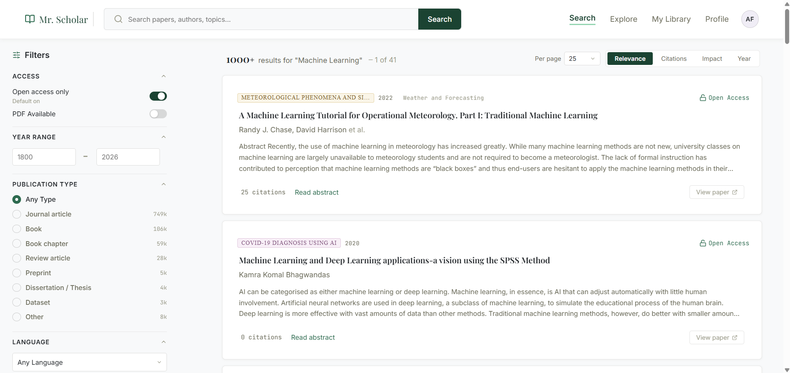
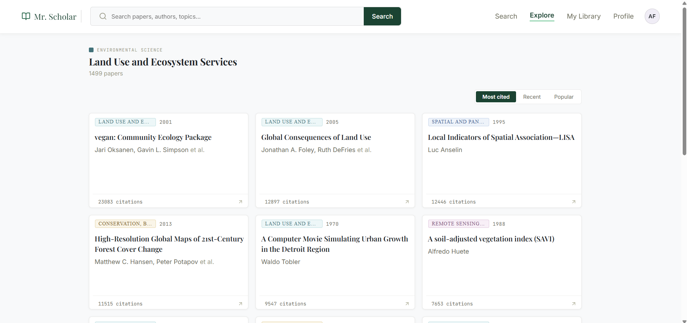
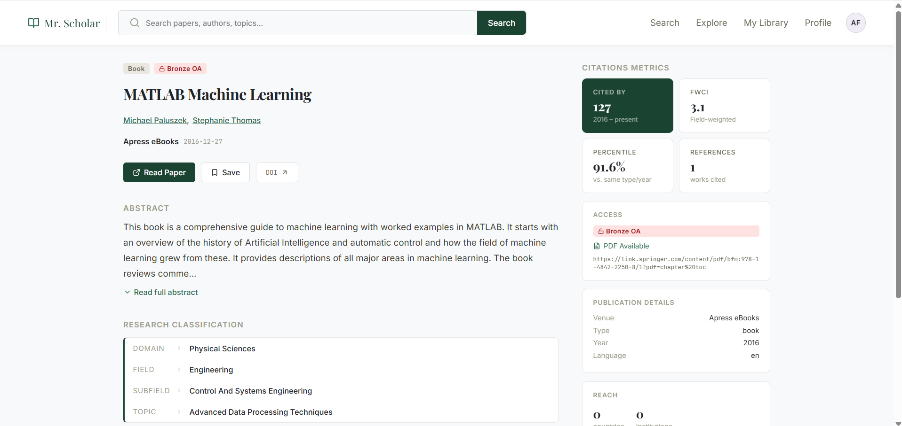
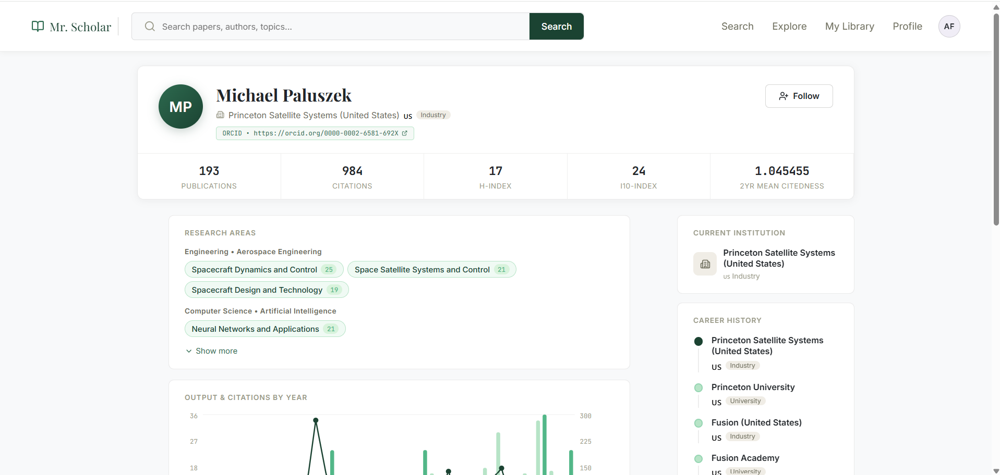
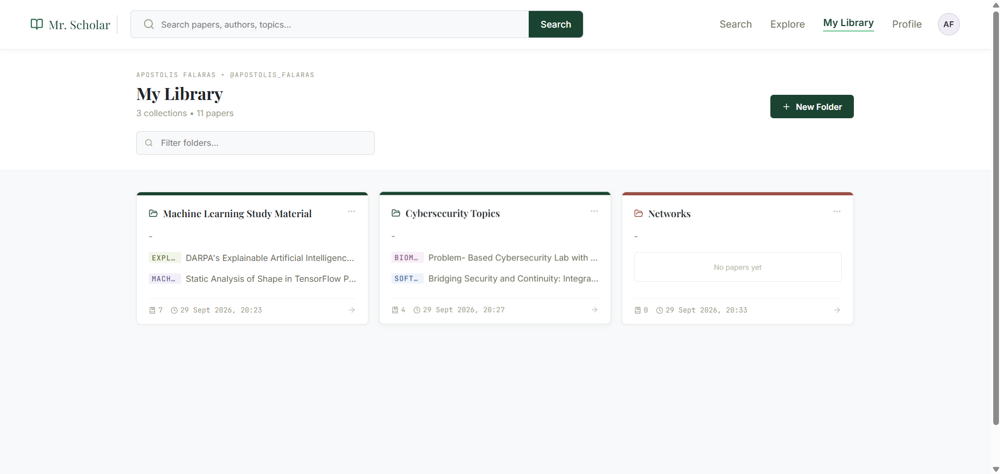
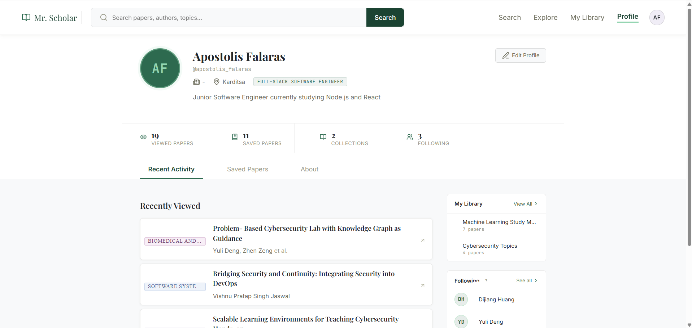

# Mr. Scholar

A full-stack research paper discovery platform for searching, exploring, organizing, and receiving personalized recommendations across a large scholarly dataset derived from OpenAlex.

Mr. Scholar combines scholarly search, research exploration, personal libraries, author discovery, and a hybrid recommendation system in a single application backed by PostgreSQL and a custom OpenAlex data pipeline.


## Features

- **Scholarly search** — Search papers and refine results using publication, access, language, citation, author, topic, and year filters.
- **Research exploration** — Browse research topics and discover papers through topic-oriented exploration.
- **Paper intelligence** — View abstracts, authors, research classifications, citation metrics, publication metadata, access information, references, and related works.
- **Author profiles** — Explore publication histories, research areas, affiliations, citation statistics, and top papers.
- **Personal research library** — Organize papers into custom collections and manage saved research.
- **Researcher profiles** — Track recently viewed and saved papers, followed authors, collections, and profile information.
- **Personalized recommendations** — Generate recommendations from user interests, reading activity, collaborative signals, topic relevance, popularity, and recency.
- **Background recommendation refresh** — Recompute user profiles, similarities, recommendation caches, and popularity signals asynchronously as user activity changes.
- **OpenAlex data pipeline** — Fetch, preprocess, normalize, and ingest scholarly works, authors, topics, references, and related works into PostgreSQL.

## Screenshots

### Search and Discovery

Search across the indexed scholarly dataset and refine results using research-specific filters and sorting options.



Explore research areas and browse papers associated with individual topics.



### Paper Details

Paper pages combine bibliographic information with citation metrics, access information, research classification, authors, references, and related scholarly data.



### Author Profiles

Author pages provide research areas, publication and citation statistics, institutional history, yearly output, and representative papers.



### Personal Library

Authenticated users can create collections and organize saved papers into their own research library.



### Researcher Profile

User profiles bring together reading activity, saved papers, collections, followed authors, and researcher information.



## Recommendation System

Mr. Scholar includes a hybrid recommendation system that builds researcher preference profiles from paper interactions and combines multiple recommendation signals.

The recommendation pipeline uses:

- content-based similarity across topics, fields, subfields, domains, authors, and keywords;
- collaborative filtering based on similar users and their interactions;
- topic relevance;
- global popularity signals;
- publication recency.

Candidate papers are generated from several sources, scored by the individual recommendation algorithms, combined into a hybrid score, and stored in a recommendation cache for efficient delivery.

Recommendation state is refreshed asynchronously through a background job and refresh queue when meaningful user activity occurs.

For the algorithms, scoring formulas, candidate generation process, caching strategy, and refresh workflow, see [Recommendation System](docs/recommendation-system.md).

## Technology Stack

| Layer | Technologies |
| --- | --- |
| Frontend | React, Vite, React Router |
| Backend | Node.js, Express |
| Database | PostgreSQL |
| Authentication | Express sessions, PostgreSQL session storage |
| Data Pipeline | Python, OpenAlex API |
| Testing | Vitest, React Testing Library, Supertest |
| Tooling | ESLint, npm |

## Architecture

The application is organized into four major subsystems:

```text
┌──────────────────────────┐
│      React Frontend      │
│    Search · Explore ·    │
│ Library · Profiles · UI  │
└────────────┬─────────────┘
             │ HTTP / JSON
             ▼
┌──────────────────────────┐
│    Express Application   │
│ Controllers → Services → │
│      Repositories        │
└────────────┬─────────────┘
             │
             ▼
┌──────────────────────────┐
│       PostgreSQL         │
│ Scholarly · User · Rec.  │
│          Data            │
└──────────────────────────┘
             ▲
             │
┌────────────┴─────────────┐
│  OpenAlex Data Pipeline  │
│ Fetch → Preprocess →     │
│         Ingest           │
└──────────────────────────┘
```

The backend separates HTTP handling, application logic, and persistence through controller, service, and repository layers. Recommendation algorithms and background refresh jobs operate as separate application components over the same PostgreSQL data model.

For a detailed description of the system boundaries and request flows, see [Architecture](docs/architecture.md).

## Data

The local scholarly dataset is constructed from OpenAlex through the project's Python data pipeline.

The pipeline collects a topic-oriented selection of works and expands the dataset with referenced and related works, authors, and topics. Raw API responses are preserved separately from processed JSONL datasets before ingestion into PostgreSQL.

The resulting database contains scholarly entities and relationships alongside application-specific user, interaction, library, recommendation, and popularity data.

For acquisition strategy, preprocessing, checkpoints, ingestion, and generated data layout, see [Data Pipeline](docs/data-pipeline.md).

For the relational model and table responsibilities, see [Database Design](docs/database.md).

## Getting Started

### Prerequisites

The application requires:

- Node.js
- npm
- Python
- PostgreSQL
- an OpenAlex API key

### Installation

Clone the repository:

```bash
git clone <repository-url>
cd Intelligent-Research-Paper-Discovery-Platform
```

Install backend dependencies:

```bash
cd server
npm ci
```

Install frontend dependencies:

```bash
cd ../client
npm ci
```

Python dependencies and database initialization are described in the complete setup guide.

> The scholarly dataset is generated through the included OpenAlex pipeline rather than being committed to the repository.

For environment configuration, PostgreSQL initialization, data generation, and the complete startup procedure, see **[Local Setup Guide](docs/setup.md)**.

## Development

Start the backend development server:

```bash
cd server
npm run dev
```

Start the frontend development server in a second terminal:

```bash
cd client
npm run dev
```

During development, Vite proxies application API and uploaded-file requests to the Express backend.

## Testing

Backend tests:

```bash
cd server
npm test
```

Frontend tests:

```bash
cd client
npm test
```

Frontend linting:

```bash
cd client
npm run lint
```

Production frontend build:

```bash
cd client
npm run build
```

The project includes unit, component, repository, service, and integration-level tests across the frontend and backend.

## Documentation

Detailed technical documentation is available under [`docs/`](docs/):

| Document | Description |
| --- | --- |
| [Setup](docs/setup.md) | Local environment, database, data pipeline, and application startup |
| [Architecture](docs/architecture.md) | System structure, responsibilities, and application flows |
| [Database](docs/database.md) | PostgreSQL schema and relational data model |
| [Data Pipeline](docs/data-pipeline.md) | OpenAlex acquisition, preprocessing, and ingestion |
| [Recommendation System](docs/recommendation-system.md) | Personalization algorithms, scoring, caching, and background refresh |

## Project Structure

```text
.
├── client/                    # React frontend
├── server/                    # Express backend
├── database/                  # PostgreSQL schema
├── openalex_data_pipeline/    # Python OpenAlex pipeline
├── docs/                      # Technical documentation
│   └── images/                # README/documentation screenshots
└── README.md
```

## Project Status

The application is implemented as a locally reproducible full-stack system. The repository includes the application source, database schema, data acquisition pipeline, automated tests, environment templates, and technical documentation required to construct and run the project locally.

Public hosting is not required to evaluate the project; the complete application can be reproduced from the repository using the local setup guide.

## Acknowledgements

Scholarly metadata used by the project is sourced from OpenAlex.

This project is an independent application and is not affiliated with OpenAlex.