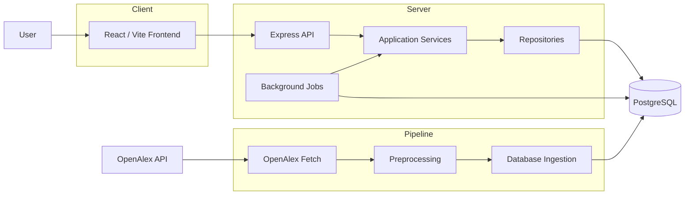

# System Architecture

This document describes the high-level architecture of the research paper discovery platform,
including its frontend, backend, persistence layer, OpenAlex data pipeline, and recommendation
subsystem.

For installation and local development instructions, see [Local Setup](./setup.md).

## Overview

The application follows a client-server architecture with a React frontend,
an Express REST API, and PostgreSQL as its persistent data store.

The backend separates HTTP handling, application logic, and database access
into controller, service, and repository layers.

Research metadata is collected separately through a Python data pipeline that retrieves data
from OpenAlex, preprocesses it, and ingests it into PostgreSQL. The pipeline operates independently
from the runtime web application.

Personalized recommendations are generated from stored user interactions and
precomputed paper features. Recommendation computation and cache refreshes are handled by backend
services and background processing rather than during normal page rendering.

## High-Level Architecture



## Repository Structure

The repository is divided into four primary components:

```text
.
├── client/                  # React/Vite frontend
├── server/                  # Express backend
├── database/                # PostgreSQL schema
├── openalex_data_pipeline/  # OpenAlex retrieval and ingestion
└── docs/                    # Project documentation
```

The frontend and backend are independently managed Node.js projects, while
the OpenAlex pipeline is a separate Python component used to construct the
research dataset consumed by the application.

## Frontend Architecture

The frontend is implemented with React and Vite and is responsible for
application navigation, presentation, user interaction, and communication
with the backend API.

### Routing and Page Composition

The frontend is organized around page-level routes using React Router.
Public routes provide access to discovery and authentication features, while
authenticated routes protect user-specific areas of the application.

Page components compose reusable UI components and feature-specific hooks.
Page-level route modules are loaded lazily using React's `lazy` and `Suspense`
APIs to reduce the initial JavaScript bundle.

### Shared State and Context

Shared application state that must be available across multiple components is
managed through React context providers. Feature-specific or component-local
state remains closer to the components that consume it.

Authentication state is exposed through the authentication context, while
shared Explore state is managed separately through the Explore context.

### API Communication

Frontend components do not access PostgreSQL directly. Data is retrieved and
modified through backend HTTP endpoints exposed under `/api`.

During local development, Vite proxies `/api` and `/uploads` requests to the
Express backend, allowing the frontend to use relative application URLs
without embedding a separate development API origin.

## Backend Architecture

The backend is implemented as an Express application and separates HTTP
routing, application logic, and persistence concerns into distinct layers.

A typical request follows the path:

```text
HTTP Request
     ↓
   Router
     ↓
 Middleware
     ↓
 Controller
     ↓
  Service
     ↓
Repository
     ↓
 PostgreSQL
```

Results propagate back through the same layers before the controller produces
the HTTP response.

### Request Processing

Express routers map incoming API requests to the appropriate controllers.
Authentication and other cross-cutting request processing are applied through
middleware before application-specific operations are executed.

### Controller Layer

Controllers form the HTTP boundary of the backend. They extract request
parameters and authenticated-user context, invoke the corresponding service,
and translate service results or failures to HTTP responses.

### Service Layer

Services contain application-level logic and validation. They coordinate
repository operations and implement behavior independently of Express request
and response objects.

### Repository Layer

Repositories encapsulate PostgreSQL access. SQL queries and database-specific
operations are kept in this layer so that controllers and services do not directly
depend on query implementation details.

### Middleware

Middleware handles concerns that apply across multiple routes, particularly
authentication and authenticated-user context. This keeps cross-cutting HTTP
behavior separate from feature-specific controllers and services.

## Authentication and Session Management

Authentication is session-based. User credentials are handled by the backend,
while authenticated session state is stored server-side using `express-session`
with a PostgreSQL-backed session store provided by `connect-pg-simple`.

At a high level, authentication follows this flow:

```text
Browser
   |  credentials
   ↓
Authentication API
   ↓
Credential verification
   ↓
Express session
   │
   ├── Session cookie → Browser
   │
   └── Session data → PostgreSQL user_sessions
```

Subsequent authenticated requests include the session cookie. Authentication
middleware resolves the corresponding server-side session and makes the
authenticated user's identity available to protected application operations.

The backend supports both required and optional authentication depending on
the endpoint. Required authentication protects user-specific functionality,
while optional authentication allows public resources to remain accessible
while still providing authenticated-user context when a valid session exists.

The `user_sessions` table is managed by the PostgreSQL session store rather
than by the application's domain schema.

## Data Architecture

### PostgreSQL

PostgreSQL is the application's primary persistent data store. It contains
research metadata, application users and folders, user interaction data,
recommendation features and caches, and supporting application state.

The runtime backend accesses PostgreSQL through repository modules. The
OpenAlex data pipeline writes research metadata into the same database during
dataset construction.

For detailed information about the database model and relationships, see
[Database Design](./database.md).

### OpenAlex Data Pipeline

Research metadata is acquired separately from the runtime web application
through a Python data pipeline.

Each dataset passes through three stages:

```text
OpenAlex
    ↓
  Fetch
    ↓
Preprocess
    ↓
 Ingest
    ↓
PostgreSQL
```

The datasets are processed in dependency order:

```text
Main Works
    ↓
Referenced and Related Works
    ↓
Authors
    ↓
Topics
```

Each fetch → preprocess → ingest sequence is completed before processing the
next dataset.

For pipeline setup and execution instructions, see [Local Setup](./setup.md).

## Recommendation Architecture

The recommendation subsystem separates user-interaction collection,
recommendation computation, and recommendation delivery. Personalized
recommendations are cached rather than recomputed from scratch whenever a
recommendation page is requested.

### User Interaction Collection

Relevant user interactions with papers are persisted in PostgreSQL. These
interactions provide behavioral signals used to construct user preferences
and generate personalized recommendations.

Interaction processing also maintains global paper metrics used by
popularity-based recommendation logic.

### Recommendation Computation

Recommendation generation combines multiple sources of information,
including user preferences, paper features, similarities between users,
topic relevance, popularity signals, and publication recency.

Candidate papers are collected from several sources, including the user's
preferred topics and subfields, popular and recent papers, saved-paper
relationships, and interactions from similar users. Papers the user has
already interacted with are excluded from the candidate set.

The remaining candidates receive content-based, collaborative, topic,
popularity, and recency scores. These signals are combined into a hybrid
score used to rank the final recommendations.

### Cached Recommendations

Final personalized recommendations are persisted in a recommendation cache.
API requests can therefore retrieve previously computed recommendation
results without executing the complete recommendation pipeline during the
request.

### Background Refresh Processing

Relevant paper interactions update both user-specific interaction state and
global paper metrics. They also mark recommendation or popularity state as
requiring refresh.

A scheduled background job runs every 30 minutes. Each execution checks
whether global popularity scores require rebuilding. Personalized
recommendation caches are rebuilt on every second scheduled execution for
users whose recommendations have been marked stale.

For each stale user, the background workflow rebuilds the user's preference
profile, refreshes the user-similarity cache, rebuilds the recommendation
cache, and finally marks the refresh request as processed.

At a high level:

```text
                         User Interaction
                                ↓
                 ┌──────────────┴──────────────┐
                 ↓                             ↓
       User Interaction State             Paper Metrics
                 ↓                             ↓
Recommendation Refresh Queue       Popularity Refresh State
                 │                             │
                 └──────────────┬──────────────┘
                                ↓
                       Background Processing
                                ↓
                    User Preference Profile
                                ↓
                     User Similarity Cache
                                ↓
                  Recommendation Computation
                                ↓
                  User Recommendation Cache
                                ↓
                     Recommendation API
                                ↓
                           Frontend
```

For details about candidate generation, scoring, and the individual
recommendation algorithms, see [Recommendation System](./recommendation-system.md).

## End-to-End Request Flows

### Search Request

A search request crosses the frontend, API, backend application layers, and
database before returning the resulting papers to the interface.

```text
User
 ↓
Search Interface
 ↓
Frontend API Request
 ↓
GET /api/search
 ↓
Search Controller
 ↓
Search Service
 ↓
Search Repository
 ↓
PostgreSQL
 ↓
Search Results
 ↓
Frontend
```

### Authenticated Paper Interaction

Authenticated paper interactions are associated with the current user through
the server-side session. Views, saves, unsaves, and recommendation clicks
provide signals used by the recommendation subsystem.

```text
Authenticated User
        ↓
     Frontend
        ↓
    Express API
        ↓
Authentication Middleware
        ↓
Recommendation Event Service
        ↓
┌───────────────────────────────┐
│ User Interaction State        │
│ Global Paper Metrics          │
│ Popularity Refresh State      │
│ Recommendation Refresh Queue  │
└───────────────────────────────┘
```

### Recommendation Refresh

Recommendation updates are separated from normal recommendation retrieval.
Interactions can request a refresh, which is subsequently processed by the
background recommendation workflow.

```text
Recommendation Refresh Queue
        ↓
Background Worker
        ↓
Rebuild User Preference Profile
        ↓
Rebuild User Similarity Cache
        ↓
Generate Candidate Papers
        ↓
Compute Recommendation Signals
        ↓
Calculate Hybrid Scores
        ↓
user_recommendation_cache
        ↓
Recommendation API
```

## Architectural Boundaries

The system maintains several explicit architectural boundaries:

- The frontend communicates with application data through the backend API
  rather than accessing PostgreSQL directly.
- Controllers handle HTTP concerns, services contain application logic, and
  repositories encapsulate SQL and database access.
- OpenAlex data acquisition and preprocessing are separated from the runtime
  web application.
- PostgreSQL acts as the shared persistence layer for research metadata,
  application state, user interactions, and recommendation data.
- Recommendation computation is separated from recommendation delivery through
  persisted features, refresh state, background processing, and cached results.
- Authentication state is maintained server-side using PostgreSQL-backed
  sessions.